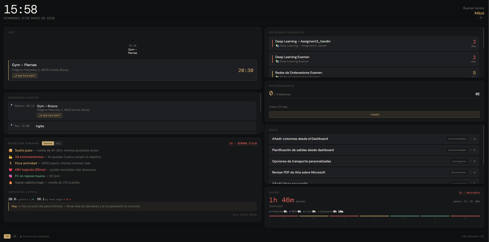

# Life Assistant

Dashboard personal que centraliza calendario, salud, entrenamientos, finanzas, ideas, ropa, hogar
inteligente y un agente PC autónomo — y, por encima de todo eso, un asistente (Jarvis)
que consulta, actúa y avisa sin que se le pida.

**Demo:** [life-assistant-smoky.vercel.app](https://life-assistant-smoky.vercel.app)

> **¿Quieres el tuyo?** El proyecto es replicable: cada instancia corre con tus
> propias cuentas (Outlook, Supabase, API keys) sobre free tiers de Vercel y
> Fly.io. Guía completa paso a paso en [`docs/DESPLIEGUE.md`](docs/DESPLIEGUE.md).



---

## Funcionalidades

### Agenda y tiempo
- **Timeline de hoy** — mezcla eventos de Outlook y calendario de clases, con indicador de evento activo y cálculo de hora de salida con tráfico real (Google Maps)
- **Próximos 7 días** — vista rápida de lo que viene
- **Entregas** — detecta eventos con 📚 en el título y los ordena por urgencia con semáforo de colores; busca en ambos calendarios (general y clases)
- **Clases** — panel lateral con el horario semanal universitario

### Salud (Apple Watch)
Los datos llegan automáticamente desde Apple Watch via Health Auto Export e iOS Shortcuts:

- **Bienestar** — puntuación 0–100 con dos vistas:
  - *Semana*: promedios de los últimos 7 días + entrenamientos desde el lunes
  - *Hoy*: valores del día actual
  - Score: sueño 25 pts · actividad 30 pts · recuperación 25 pts · forma física 10 pts · estilo de vida 10 pts
  - Insights automáticos y recomendación diaria

- **Sueño** — duración total, fases (profundo / REM / core / despierto) con tooltips explicativos, puntuación 0–100 y resumen de las últimas 7 noches. Permite **anular noches** con datos incorrectos (p.ej. Watch en carga) para que no afecten a las métricas

- **Frecuencia cardíaca** — sparkline 30 días
- **HRV** — sparkline con tendencia vs semana anterior
- **Actividad** — pasos, calorías y barras de los últimos 7 días
- **Entrenamientos AW** — lista de entrenamientos sincronizados desde Hevy → Apple Health

### Entrenamiento personal
- Contador de sesiones desde el último cobro, horas acumuladas e importe pendiente
- Formulario para añadir sesiones y registrar cobros
- Configuración de precio/hora y sesiones por cobro

### Finanzas
Cartera de [Indexa Capital](https://indexacapital.com) por su API oficial (solo lectura): valor total, cuánto se ha aportado, plusvalía en euros y en porcentaje, rentabilidad anualizada, mezcla por clase de activo y el detalle de posiciones. Enseña siempre a qué día corresponde la valoración —Indexa valora una vez al día y con retraso— y lo que no se sabe sale como `—`, nunca como 0 €.

### Ideas por voz
Graba audio → Whisper transcribe → GPT-4o-mini extrae título, categoría y resumen → se guarda en Supabase. Si la nota apunta a una cita, el panel **ofrece** crear el evento con un chip; nunca lo crea solo.

### Ropa
Registro de prendas con foto, precio y moneda, y conteo/total acumulado por divisa.

### Jarvis — el asistente
Chat (texto y voz) que consulta y actúa sobre el resto del dashboard con más de 50 herramientas: calendario, salud, entrenamiento, hogar, PC, memoria de hechos duraderos, cliente MCP con lista blanca del usuario y búsqueda web con defensas contra SSRF e inyección de prompt. Reparte el trabajo entre un modelo pequeño (decide si hace falta actuar) y uno grande (elige y ejecuta la herramienta), y pide confirmación explícita antes de tocar el calendario, conectar un servidor MCP nuevo o abrir una cerradura.

### Lo proactivo
El sistema también habla sin que se le pregunte: avisa de la hora de salida con tráfico real, de que dos citas no dejan tiempo para moverse entre ellas, de que toca ponerse el reloj antes de dormir, de huecos libres para entrenar o de una posible bajada de forma. Los avisos compiten por un presupuesto diario, aprenden de si se marcan útiles o no, y no repiten la misma situación dos veces.

### Resumen diario e informe semanal
Un correo con los datos del día en crudo (sin interpretar por ningún modelo) que sale al detectar que te has despertado — o, como red de seguridad, a una hora tope si nada más lo dispara. Un solo envío garantizado por día. Los domingos se añade un informe semanal con la evolución de las últimas trece semanas.

### Hogar inteligente
- **Wake-on-LAN** — enciende el PC físico desde el dashboard a través de Home Assistant, sin conexión directa desde el browser
- **Apagado/suspensión remotos** del PC por SSH
- **Notificaciones Alexa** — anuncia el nombre del evento 15 minutos antes en voz alta
- **Avisos al móvil** — la app companion de Home Assistant entrega lo proactivo y las alertas del sistema con botones de acción

### Revisión nocturna
Cada madrugada, si hubo commits ese día en `main`, una sesión de Claude Code los revisa contra las invariantes del proyecto y abre un issue con lo que encuentre. Por la mañana llega una notificación al móvil con dos botones: «Arreglarlo» (lanza otra sesión que corrige, abre PR y mergea si el CI pasa) y «No hacer nada».

### Agente PC autónomo
El agente recibe un job desde el dashboard y ejecuta la entrega universitaria de forma semiautónoma:

1. El dashboard manda señal WOL → Home Assistant enciende el PC
2. El PC arranca y el agente inicia heartbeat
3. Playwright abre Edge con el perfil real del usuario (cookies persistidas), navega a Alud (Moodle de Deusto) y extrae el enunciado
4. Abre Claude Desktop en modo Cowork y le pega el enunciado con instrucciones
5. El usuario revisa y envía la entrega manualmente

El dashboard muestra la barra de progreso en tiempo real con las etapas del agente.

---

## Stack

| Capa | Tecnología |
|---|---|
| Frontend | React 19 + Vite, desplegado en Vercel (PWA instalable) |
| Backend | FastAPI (Python 3.11), un solo fichero, desplegado en Fly.io (escala a cero) |
| Base de datos | Supabase (PostgreSQL vía REST, solo accesible con la service key) |
| Calendario | Microsoft Graph API (Outlook) |
| Mapas | Google Maps Distance Matrix API |
| Clima | Open-Meteo (gratis, sin API key) |
| IA | OpenAI Whisper + GPT-4o-mini — transcripción, extracción de ideas y el cerebro de Jarvis |
| Salud | Apple Watch → Health Auto Export + iOS Shortcuts |
| Smart home | Home Assistant (sondeo REST + SSH) |
| Agente PC | Playwright (Edge) + pyautogui + Claude Desktop, en Windows |
| CI | GitHub Actions — lint, tests de frontend/backend y build en tres jobs paralelos |

---

## Arquitectura

```
Browser (React 19 + Vite, Vercel)
    │  JWT en localStorage + REST
    ▼
backend/main.py (FastAPI, Fly.io, escala a cero — un solo fichero, ~10.700 líneas)
    ├── Microsoft Graph API   ─── Calendario Outlook (tokens OAuth en Supabase)
    ├── Google Maps API       ─── Hora de salida con tráfico real
    ├── Open-Meteo            ─── Clima
    ├── OpenAI API            ─── Whisper (voz) + GPT-4o-mini (ideas y Jarvis)
    ├── Supabase REST         ─── Ideas, ropa, jobs, entrenamiento, salud, memoria...
    └── Home Assistant        ─── HA sondea órdenes (WOL, avisos, apagado por SSH,
                                   tick del resumen diario) y EMPUJA presencia

Apple Watch ── Health Auto Export + iOS Shortcuts ──► POST /health/ingest

Home Assistant (red local, siempre encendido)
    └── Sondea el backend cada 15–30s y dispara el tick del resumen cada 5 min

Agente PC (Windows, efímero — arranca, drena la cola de jobs, se cierra)
    ├── Playwright + Edge     ─── Automatización web (Alud/Moodle)
    ├── pyautogui             ─── Control de UI (Claude Desktop)
    └── Supabase              ─── Cola de jobs (polling con token propio)
```

### Layout del dashboard

Dos columnas redimensionables arrastrando el divisor central. Cada widget es configurable (visible/oculto, columna, orden, tamaño) desde el panel ⚙. La configuración se persiste en `localStorage`.

---

## Configuración

### Requisitos previos
- Node.js 20+
- Python 3.11+
- Cuenta de Microsoft con Outlook y app registrada en Azure AD
- Proyecto en Supabase
- API keys: Google Maps, OpenAI
- *(Opcional)* Home Assistant, Apple Watch con Health Auto Export, cuenta de Anthropic (agente PC)

Guía completa paso a paso, con todas las variables explicadas una a una, en
[`docs/DESPLIEGUE.md`](docs/DESPLIEGUE.md). Resumen rápido:

### Frontend

```bash
npm install
npm run dev        # http://localhost:5173
npm run build
```

### Backend

```bash
cd backend
python -m venv venv
venv\Scripts\activate   # Windows
# source venv/bin/activate   # macOS/Linux
pip install -r requirements.txt
uvicorn main:app --reload   # http://localhost:8000
```

Copiar `backend/.env.example` a `backend/.env` y rellenar los valores (comprobar con
`python backend/check_config.py`). `SECRET_KEY` y `DASHBOARD_PASSWORD` son obligatorias
— el backend no arranca sin ellas, sin fallback, porque el repositorio es público.

Autenticar con Outlook (primera vez):
1. Visitar `http://localhost:8000/auth/login`
2. Completar el flujo OAuth de Microsoft
3. El refresh token se guarda en la tabla `oauth_tokens` de Supabase (sobrevive a los redeploys)

### Agente PC

```bash
cd agent
pip install -r requirements.txt
```

Copiar `agent/.env.example` a `agent/.env` y rellenar los valores — en particular
`AGENT_TOKEN` (mismo valor que en `backend/.env`, no caduca) en vez del JWT del
dashboard, que caduca a los 30 días. Solo funciona sobre un Windows real (Edge,
pyautogui, Claude Desktop).

### Ingesta de salud (Apple Watch)

El backend expone `POST /health/ingest?token=HEALTH_INGEST_TOKEN` compatible con [Health Auto Export](https://www.healthexportapp.com/) (formato JSON v2). Configurar dos automatizaciones en la app: una para métricas y otra para workouts, apuntando a la URL del backend.

---

## Despliegue

**Frontend** — push a `main` despliega automáticamente en Vercel.

**Backend (Fly.io)**:
```bash
cd backend
fly deploy
```

Los secrets se configuran con `fly secrets set KEY=value` y no se incluyen en el repositorio.

---

## Estructura del proyecto

```
├── src/
│   ├── components/
│   │   └── Dashboard.jsx      # UI completa (~5.600 líneas)
│   └── lib/
│       └── helpers.js         # Lógica pura del frontend, testeada aparte
├── backend/
│   └── main.py                # API FastAPI, un solo fichero (~10.700 líneas, 73 endpoints)
├── agent/
│   └── agent.py                # Agente PC autónomo (solo funciona en Windows real)
├── supabase/
│   └── migrations/             # Esquema de BD (se aplican a mano en Supabase)
├── tests/                       # Backend (pytest), frontend (vitest) y E2E (Playwright)
├── docs/                        # Guía detallada por áreas (ver CLAUDE.md)
└── public/
```

Documentación completa del proyecto, para trabajar en él o para entenderlo desde fuera:
[`CLAUDE.md`](CLAUDE.md) (índice de trabajo) y
[`docs/EL_PROYECTO_EXPLICADO.md`](docs/EL_PROYECTO_EXPLICADO.md) (explicación de arriba
abajo, sin necesidad de tocar código).
